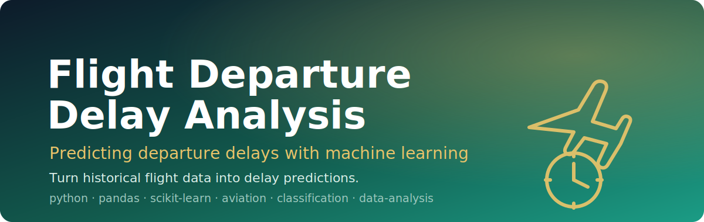

<p align="center">
  
</p>

<h1 align="center">Flight Departure Delay Analysis</h1>

<p align="center"><em>Predicting flight departure delays from historical flight data using machine learning.</em></p>

<p align="center">
  
  
  
  
  
</p>

**Flight Departure Delay Analysis** is a machine-learning project that learns from **historical flight data** to predict whether — and to what extent — a flight is likely to depart late. It frames departure delay as a **classification / data-analysis** problem over aviation operational data, built around the standard Python data stack (**pandas**, **scikit-learn**).

> Delays cascade across a network — anticipating them early is the first step to managing them.

---

## ✨ Features
- Predicts **flight departure delays** from historical flight records.
- Treats delay prediction as a supervised **classification** task on aviation data.
- Built on the conventional Python ML toolchain: **pandas** for data wrangling, **scikit-learn** for modeling.
- Focused, single-purpose codebase that's easy to extend with new features or models.

## 🏗️ Pipeline
A typical departure-delay modeling flow looks like this:

```
historical flight data
        │
        ▼
  load + clean (pandas)
        │
        ▼
 feature engineering        e.g. carrier, route, scheduled time, day/time features
        │
        ▼
 train / test split
        │
        ▼
 train classifier (scikit-learn)
        │
        ▼
 evaluate → predict departure delay
```

## 🚀 Run it
```bash
# 1. Clone
git clone https://github.com/Usman1Abbas/Advanced-Flight-Departure-Delay-Analysis.git
cd Advanced-Flight-Departure-Delay-Analysis

# 2. (Recommended) create a virtual environment
python -m venv .venv
# Windows:  .venv\Scripts\activate
# macOS/Linux:  source .venv/bin/activate

# 3. Install the core data-science stack
pip install pandas scikit-learn numpy matplotlib jupyter

# 4. Open the analysis
jupyter notebook
```

> Note: this repository is an early-stage project. Point the pipeline at your historical
> flight dataset, then run the notebook / scripts to train and evaluate the delay model.

## 🗺️ Roadmap
- [ ] Add the data-loading and preprocessing scripts/notebook.
- [ ] Commit a `requirements.txt` pinning the exact dependencies.
- [ ] Document the dataset source and feature set.
- [ ] Report model choice and evaluation metrics (accuracy / precision / recall).
